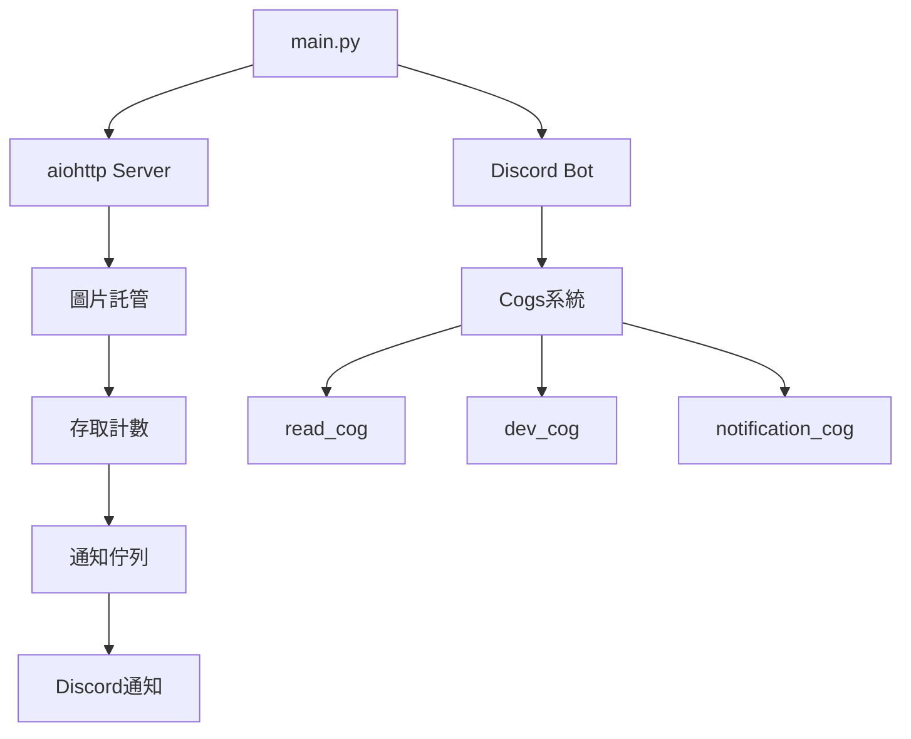

# 📱 Discord 已讀回執測試器

> 一個結合 Discord Bot 和 Web 伺服器的已讀回執測試系統，用於檢測 Discord 私訊是否被查看。

[](https://python.org)
[](https://discordpy.readthedocs.io/)
[](https://aiohttp.readthedocs.io/)
[](LICENSE)

> [點此安裝](https://discord.com/oauth2/authorize?client_id=1402571906594508820)


## 🎯 專案目標

此專案是一個**示範性質**的 Discord 已讀回執測試系統，展示了：

- **Discord Bot 與 Web 伺服器整合**：同時運行 Discord Bot 和 aiohttp Web 伺服器
- **異步通信機制**：使用 `asyncio.Queue` 實現進程內通信
- **模組化架構**：採用 Discord.py Cogs 系統進行功能分離
- **實時通知系統**：當圖片被多次存取時自動發送 Discord 通知

## ✨ 核心功能

### 🤖 Discord Bot 功能
- `/read` - 發送已讀測試訊息給指定用戶
- `/url` - 生成已讀測試圖片連結
- `.dev` 系列開發者指令（模組管理、重載等）

### 🌐 Web 伺服器功能
- 圖片託管服務
- 存取計數追蹤
- 自動 Discord 通知（3次存取後觸發）

### 🔔 通知系統
- 實時監控圖片存取
- 美化的 Discord Embed 通知
- 詳細的存取記錄和時間戳

## 📁 專案架構

```
ReadTest/
├── 🚀 main.py                 # 主程式入口（同時啟動 Bot 和 Web 伺服器）
├── 🤖 bot.py                  # Discord Bot 單獨啟動檔
├── 🌐 server.py               # aiohttp Web 伺服器
├── ⚙️ settings.py             # 配置管理
├── 📡 communication.py        # 進程內通信系統
├── 📋 requirements.txt        # 依賴套件
├── 📄 README.md              # 專案說明（本檔案）
├── 🔑 .env                   # 環境變數（需要創建）
├── 📂 cogs/                  # Discord Bot 功能模組
│   ├── 📖 read_cog.py        # 已讀測試核心功能
│   ├── 🛠️ dev_cog.py         # 開發者工具（熱重載等）
│   ├── 📊 notification_cog.py # 通知處理模組
│   └── 📝 example_cog.py     # 範例模組
├── 🛠️ utils/                 # 工具函數
│   ├── 📝 log.py             # 日誌系統
│   └── 🎨 ui.py              # UI 工具
├── 🖼️ img/                   # 圖片儲存目錄
└── 📋 logs/                  # 日誌檔案目錄
```

## 🚀 快速開始

### 1. 環境準備

```bash
# 克隆專案
git clone <your-repo-url>
cd ReadTest

# 建立虛擬環境（推薦）
python -m venv .venv
source .venv/bin/activate  # Linux/Mac
# 或
.venv\Scripts\activate     # Windows

# 安裝依賴
pip install -r requirements.txt
```

### 2. 環境設定

創建 `.env` 檔案：

```env
# Discord Bot Token
DISCORD_BOT_TOKEN=你的_Discord_Bot_Token

# 通知接收頻道 ID（可選）
NOTIFICATION_CHANNEL_ID=你的頻道ID
```

### 3. 伺服器設定

編輯 `settings.py` 中的伺服器配置：

```python
# 設定伺服器的 URL（用於生成圖片連結）
SERVER_URL = "http://your-domain.com"  # 替換為你的實際域名或 IP

# 設定伺服器端口
PORT = 1031  # 可以修改為其他可用端口
```

**重要說明**：
- `SERVER_URL`：這是用於生成已讀測試圖片連結的基礎 URL
  - 本地測試：`http://localhost:1031` 或 `http://127.0.0.1:1031`
  - 公開部署：`http://your-domain.com` 或 `http://your-ip:1031`
- `PORT`：Web 伺服器監聽的端口，確保此端口未被其他程式佔用

### 4. 配置 Discord Bot

1. 前往 [Discord Developer Portal](https://discord.com/developers/applications)
2. 創建新的應用程式和 Bot
3. 複製 Bot Token 到 `.env` 檔案
4. 邀請 Bot 到你的伺服器（需要以下權限）：
   - `Send Messages`
   - `Embed Links`
   - `Use Slash Commands`

### 5. 配置開發者權限

編輯 `settings.py`：

```python
DEV_ID = [
    你的Discord用戶ID,  # 替換為實際 ID
    # 可以添加多個開發者 ID
]
```

### 6. 啟動系統

```bash
# 同時啟動 Discord Bot 和 Web 伺服器
python main.py

# 或分別啟動
python bot.py      # 僅啟動 Discord Bot
python server.py   # 僅啟動 Web 伺服器（需要 Bot 實例）
```

## 🎮 使用指南

### Discord 指令

#### 📖 已讀測試功能

```bash
/read [user]
# 發送已讀測試訊息給指定用戶（預設為自己）
# 例：/read @朋友

/url target_user [user] [remark]
# 生成已讀測試圖片連結
# 例：/url 小明 @自己 生日快樂
```

#### 🛠️ 開發者指令

```bash
.dev reload [module]     # 重載模組
.dev load <module>       # 載入模組
.dev unload <module>     # 卸載模組
.dev restart            # 重啟 Bot
.dev test              # 測試連接
```

### Web 端點

```http
GET /                    # 伺服器狀態檢查
GET /img/{filename}      # 圖片存取（觸發已讀檢測）
```

## 🔧 技術架構

### 核心技術棧

- **Discord.py 2.0+** - Discord Bot 框架
- **aiohttp** - 異步 Web 伺服器
- **asyncio** - 異步程式設計
- **Rich** - 美化控制台輸出
- **Watchdog** - 檔案監控（熱重載）

### 系統架構圖



### 通信機制

系統使用 `asyncio.Queue` 實現 Web 伺服器和 Discord Bot 之間的通信：

1. 用戶存取圖片 → Web 伺服器記錄
2. 達到閾值（3次）→ 訊息放入佇列
3. notification_cog 監聽佇列 → 發送 Discord 通知

## 🎨 客製化

### 修改通知觸發條件

編輯 `server.py`：

```python
# 修改觸發次數（預設為 3）
if dict_[filename] == 3:  # 改為你想要的數字
```

### 修改伺服器設定

編輯 `settings.py`：

```python
# 修改伺服器 URL（重要：影響圖片連結生成）
SERVER_URL = "http://your-new-domain.com"

# 修改伺服器端口
PORT = 8080  # 改為你偏好的端口
```

### 自訂通知樣式

編輯 `cogs/notification_cog.py` 中的 `send_file_access_warning` 方法來客製化 Embed 樣式。

### 添加新功能

在 `cogs/` 目錄下創建新的 `.py` 檔案：

```python
import logging
from discord.ext import commands
from discord import app_commands, Interaction

class YourCog(commands.Cog):
    def __init__(self, bot):
        self.bot = bot
    
    @app_commands.command(name="hello", description="打招呼")
    async def hello(self, interaction: Interaction):
        await interaction.response.send_message("Hello, World!")

async def setup(bot):
    await bot.add_cog(YourCog(bot))
    logging.info(f'{__name__} 已載入')
```

## 📊 系統監控

### 日誌系統

- **控制台輸出**：使用 Rich 美化的即時日誌
- **檔案記錄**：按日期自動分類的日誌檔案
- **多層級**：INFO、WARNING、ERROR 等不同層級

### 監控要點

- Discord Bot 連接狀態
- Web 伺服器運行狀態
- 圖片存取統計
- 通知發送成功率

## 🔒 安全性考量

⚠️ **重要提醒**：此專案僅供學習和測試用途

### 安全建議

1. **不要在生產環境使用**
2. **保護好你的 Discord Bot Token**
3. **定期檢查存取日誌**
4. **謹慎設定開發者權限**

### 隱私聲明

此系統會記錄：
- 圖片存取時間和 IP 位址
- 用戶互動記錄
- 請確保遵守相關隱私法規

## 📚 學習資源

### 相關技術文檔

- [Discord.py 官方文檔](https://discordpy.readthedocs.io/)
- [aiohttp 官方文檔](https://docs.aiohttp.org/)
- [asyncio 教學](https://docs.python.org/3/library/asyncio.html)

### 進階功能建議

- 添加資料庫支援（SQLite/PostgreSQL）
- 實現 Web 控制面板
- 增加更多通知渠道（Webhook、Email）
- 添加圖片上傳功能

## 🐛 問題排除

### 常見問題

#### Q: Bot 無法啟動？
A: 檢查：
- `.env` 檔案中的 Token 是否正確
- Bot 是否有足夠的權限
- Python 版本是否為 3.8+

#### Q: Web 伺服器無法訪問？
A: 檢查：
- 防火牆設定
- 端口是否被佔用（檢查 `settings.py` 中的 `PORT` 設定）
- `SERVER_URL` 是否正確配置
- 本地測試使用：`http://localhost:端口號`
- 公開部署需確保域名/IP 正確且可從外部訪問

#### Q: 圖片連結無法載入？
A: 檢查：
- `SERVER_URL` 設定是否正確
- Web 伺服器是否正常運行
- 圖片檔案是否存在於 `img/` 目錄
- 網路連接是否正常

#### Q: 通知沒有發送？
A: 檢查：
- notification_cog 是否已載入
- 通知頻道 ID 是否正確設定
- Bot 是否有訊息發送權限

### 除錯模式

啟用詳細日誌：

```python
import logging
logging.basicConfig(level=logging.DEBUG)
```

## 🤝 貢獻

歡迎提交 Issue 和 Pull Request！

### 開發指南

1. Fork 此專案
2. 創建功能分支：`git checkout -b feature/新功能`
3. 提交更改：`git commit -am '新增某功能'`
4. 推送到分支：`git push origin feature/新功能`
5. 提交 Pull Request

## 📄 授權條款

此專案採用 [MIT 授權條款](LICENSE)。

## 📞 聯絡資訊

- **作者**：Dong-Chen-1031
- **GitHub**：Dong-Chen-1031

---

> ⚠️ **免責聲明**：此專案僅供教育和測試目的。使用者需自行承擔使用風險，並確保遵守相關法律法規和平台服務條款。

*最後更新：2025年9月6日*
